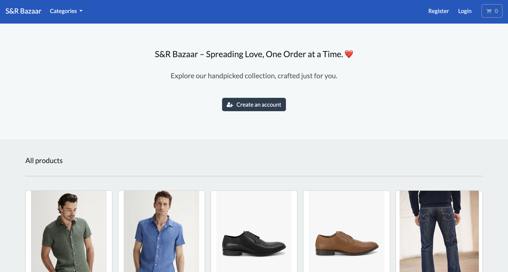
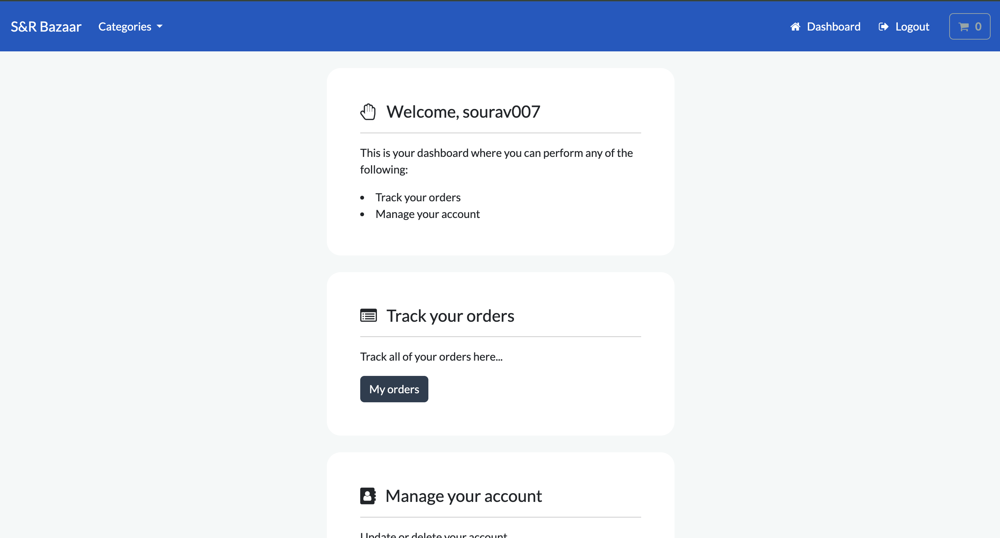
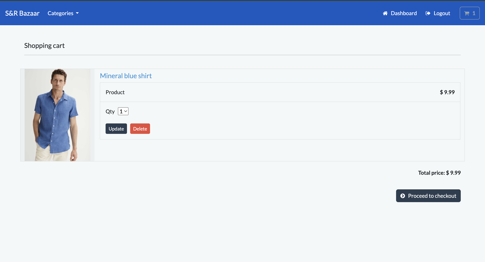
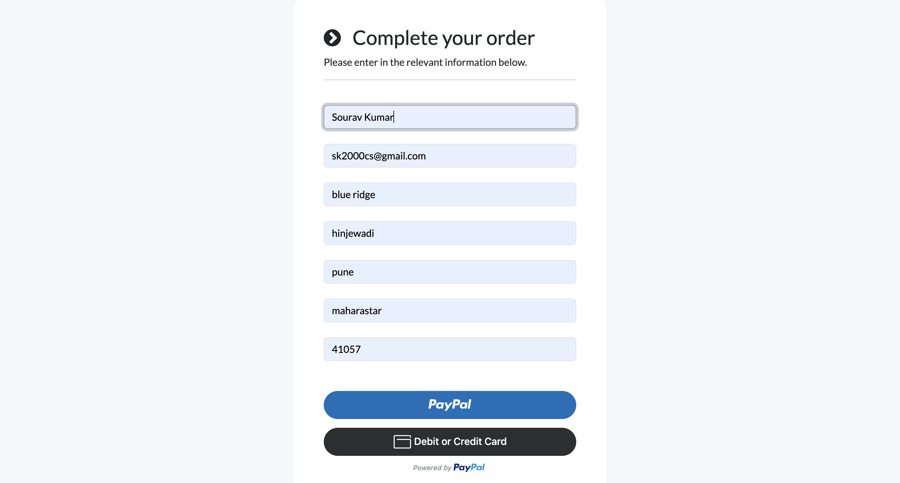
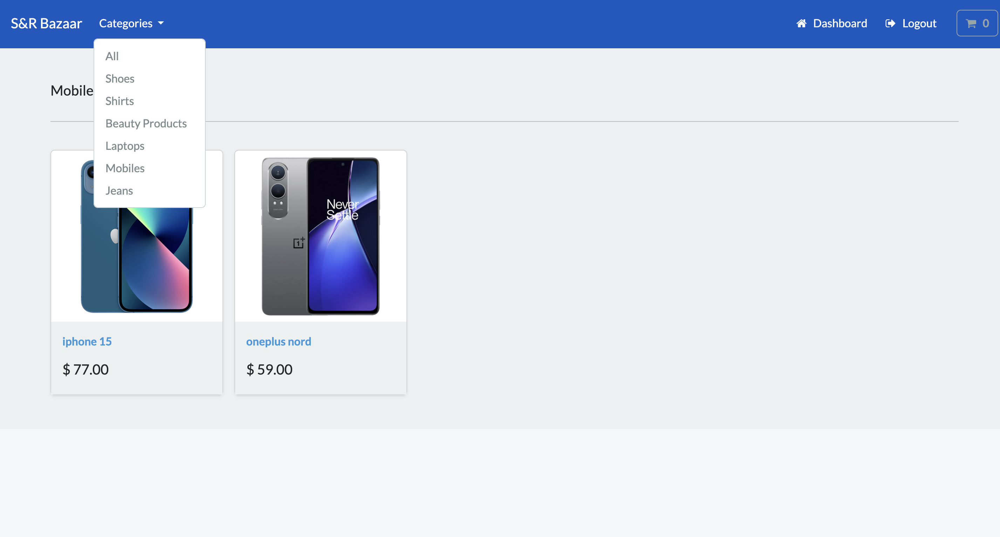
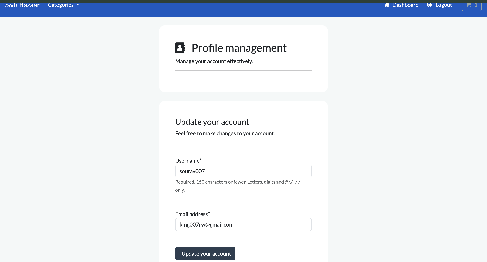
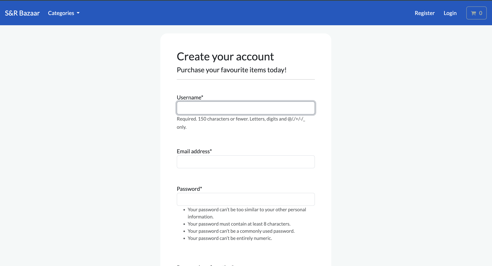

# 🛒 Srbazaar — Django E-commerce Platform

Srbazaar is a full-fledged **e-commerce web application** built using **Django**. It allows users to browse products, manage carts, and securely place orders. Admins can easily manage inventory with CRUD operations. Payments are handled seamlessly via **PayPal integration**.

## ✨ Features

- 🔐 **User Authentication** — Secure sign-up & login via email
- 📦 **Product Management** — Add, update, or remove items (CRUD)
- 🛍️ **Cart & Checkout** — Add to cart, update quantity, apply discounts
- 💳 **Payment Integration** — Seamless PayPal checkout
- 🧾 **Order Management** — Order confirmation, history, and details
- 🎯 **Admin Panel** — Django admin interface for inventory management

## 🖼️ Screenshots

> Screenshots of the app in action:

### 🏠 Home Page


### 📄 Dashboard


### 🛒 Cart Page


### 💳 Checkout Page


### 🔐 Authentication


### 🔐 Category 



### 🔐 Profile Management 


### 🔐 Register 


## 🛠️ Tech Stack

- **Backend**: Django, SQLite/PostgreSQL
- **Frontend**: HTML, CSS, JavaScript, Bootstrap
- **Payments**: PayPal
- **Deployment**: AWS (AWS EC2, RDS, S3, Route 53 )

## 🚀 Getting Started

### Clone the Repo

```bash
git clone https://github.com/your-username/srbazaar.git
cd srbazaar
